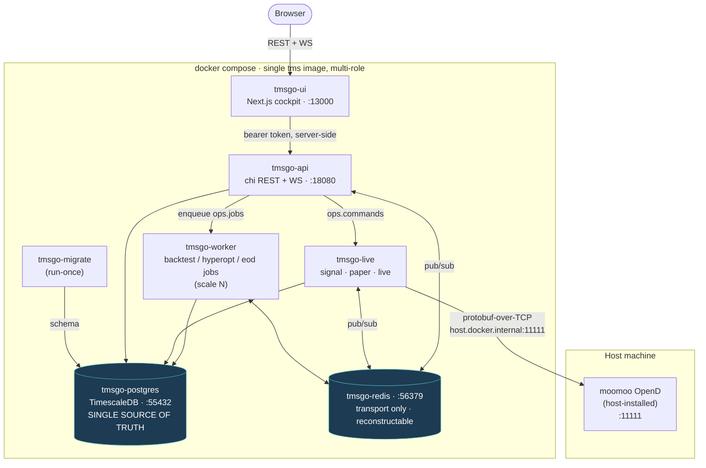
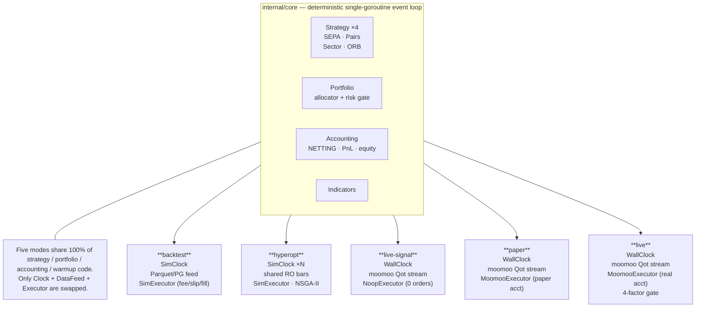
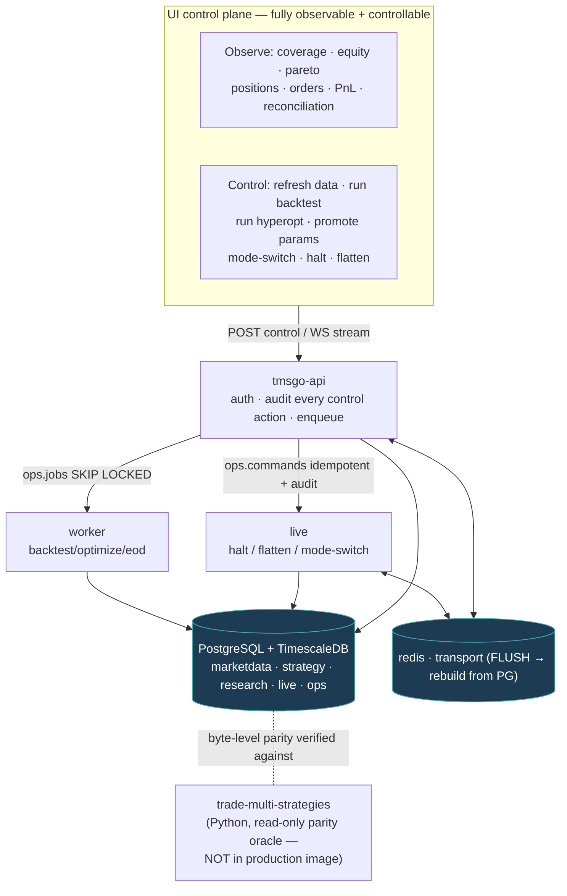

# Architecture

`trade-tms-go` is a complete Go port of the Python reference
`trade-multi-strategies`, packaged as a single static binary `tms` plus a Next.js
control-plane UI. Its thesis: **five operating modes — backtest, hyperopt,
live-signal, paper, live — all run on the SAME deterministic event-loop engine,
the SAME strategy implementations, and the SAME portfolio (allocator / risk /
reconciliation) layer.** Only the edge adapters (clock, data feed, executor,
publisher) differ between modes.

This document describes the hexagonal design, the five-modes-one-engine model,
the deterministic event loop, the sync-core / async-edge boundary, the
database-as-source-of-truth model, Redis-as-transport, and the native moomoo
OpenD client.

---

## 0. System at a glance

### 0.1 Deployment topology (Docker Compose)



### 0.2 Five modes, one engine (the thesis)



### 0.3 Control + data flow



---

## 1. Hexagonal design (ports and adapters)

The system is layered so the deterministic core has zero I/O dependencies and
all I/O is pushed to replaceable edge adapters.

```
                       ┌─────────────────────────────────────────────┐
   async edge          │                  sync core                  │   async edge
 (goroutines, I/O)     │        (single-writer, deterministic)       │  (goroutines, I/O)
                       │                                             │
  ┌──────────────┐     │   ┌──────────┐   ┌──────────┐   ┌────────┐  │     ┌──────────────┐
  │  Data feed   │────▶│──▶│ strategy │──▶│ portfolio│──▶│  exec  │──│────▶│  Executor    │
  │ (bars in)    │     │   │ (signals)│   │ (size/   │   │ (orders│  │     │ (Sim/Noop/   │
  └──────────────┘     │   └──────────┘   │  risk)   │   │ /fills)│  │     │  Moomoo)     │
                       │        ▲         └──────────┘   └────────┘  │     └──────────────┘
   ┌─────────────┐     │        │              │            │        │     ┌──────────────┐
   │ Clock       │────▶│   internal/core event loop (one goroutine)  │────▶│ Publisher    │
   │ (Sim/Wall/  │     │        │              │            │        │     │ (Redis fan-  │
   │  Virtual)   │     │        └──────────────┴────────────┘        │     │  out)        │
   └─────────────┘     │                accounting / recorder        │     └──────────────┘
                       └────────────────────┬────────────────────────┘
                                            ▼
                                  ┌────────────────────┐
                                  │ Postgres/Timescale │  ← durable system of record
                                  └────────────────────┘
```

Package layering and dependency direction (enforced by `doc.go` rules in each
package):

| Package | Role | May import |
|---|---|---|
| `internal/domain` | Core value types: `Bar`, `Signal`, `Order`, `Fill`, `Position`, fixed-point `Money`, enums, Python-compatible time. **Zero internal dependencies.** | (stdlib only) |
| `internal/core` | Cross-cutting primitives: `Event` types, the event bus, `Clock` abstraction, calendar helpers, error kinds. | `domain` |
| `internal/indicators` | Technical indicators, bit-for-bit aligned with numpy/pandas (golden tests). | `domain` |
| `internal/strategy` | `Strategy` interface + the four ported strategies (centralized-params). | `domain`, `core`, `indicators` |
| `internal/exec` | `SimExecutor` + `FillModel`; `NoopExecutor`; moomoo paper/live executor. | `domain` |
| `internal/portfolio` | Allocator (capital budget), risk limits, reconciliation, combined accounting. | `domain`, `core` |
| `internal/engine` | The deterministic event loop driving backtest **and** live from one path. | `domain`, `core`, `strategy`, `exec`, `portfolio` |
| `internal/livengine` / `internal/livetrade` | Live session wiring (wall clock, streaming feed, paper/live executors, recovery). | engine + adapters |
| `internal/hyperopt` | NSGA-II walk-forward; parameter space; study persistence. | engine + metrics |
| `internal/metrics` | Sharpe / Calmar / MaxDD / volatility, Neumaier-compensated. | `domain` |
| `internal/data`, `internal/db`, `internal/adapters`, `internal/publish` | All I/O: Sharadar import, TimescaleDB repositories, moomoo OpenD client, Redis transport. | lower layers |
| `internal/api` | chi REST + WebSocket, bearer auth (the FastAPI analog). | services |
| `internal/config` | The single config entry point: `.env` load + `MissingConfig` fail-fast. No package reads `os.Getenv` directly. | (stdlib) |

The invariants: `domain` depends on nothing internal; `engine` faces only
interfaces; all I/O converges in `adapters` / `data` / `db` / `publish`; config
is read exactly once through `internal/config`.

---

## 2. The five modes, one engine

Every mode constructs the SAME `internal/engine` loop, the SAME strategies, and
the SAME portfolio layer. The differences are entirely in four edge adapters,
selected per mode:

| Mode | Clock | Data feed | Executor | Publisher | Purpose |
|---|---|---|---|---|---|
| **backtest** | `SimClock` (advanced to each event's `ts`) | historical bars from Postgres/Timescale | `SimExecutor` + `FillModel` | none / recorder → PG | reproducible historical simulation |
| **hyperopt** | `SimClock` (N parallel backtests) | historical bars (shared, per-fold) | `SimExecutor` + `FillModel` | none (objective captured in-proc) | NSGA-II walk-forward parameter search |
| **live-signal** | `WallClock` (real UTC time) | streaming moomoo OpenD bar feed | `NoopExecutor` (records intent, submits NOTHING) | Redis fan-out + PG | shadow signal generation, no orders |
| **paper** | `WallClock` | streaming moomoo OpenD bar feed | `MoomooExecutor` (paper account) | Redis fan-out + PG | simulated broker fills, real venue |
| **live** | `WallClock` | streaming moomoo OpenD bar feed | `MoomooExecutor` (live account, gated) | Redis fan-out + PG | REAL money, 4-factor activation gate |

Because the clock is an interface (`core.Clock`), the strategy and portfolio
code is identical: a strategy reads `clock.Now()` whether that resolves to a
simulated bar timestamp or the host wall clock. `VirtualClock` (a controllable
wall clock) lets the live path be tested deterministically: a streaming run over
a virtual clock advanced in lockstep with injected bars is reproducible
bit-for-bit — the consistency proof that the live engine and the backtest engine
are the same engine.

### Clock seam

- `SimClock` — advanced by the loop to each data point's `ts` before dispatch.
  The Go analog of Nautilus's `TestClock`.
- `WallClock` — `time.Now().UTC()`. The live counterpart; reports real time
  instead of being advanced by the loop.
- `VirtualClock` — reports whatever instant it was last `Set` to, never reading
  the host clock. The deterministic-test anchor for the live path.

### What is IDENTICAL vs mode-specific (the precise seam)

The unification is not a slogan — it is a single shared assembler with exactly
two injected seams. There is ONE strategy/portfolio/context builder,
`internal/engine/strategyassembly.Assemble`, and **every mode calls it** to
produce the identical `[]engine.Strategy` + portfolio gate + context provider.
That output is then handed to one of **two engine consumers**:

| Consumer | Loop | Clock | Executor seam | Modes that use it |
|---|---|---|---|---|
| `engine.New` (**batch**) | `core.Loop` (queue-ordered) | `SimClock` | `exec.SimExecutor` + `FillModel` | backtest, hyperopt, EOD state-replay |
| `livengine.NewSession` (**streaming**) | `core.StreamLoop` | `WallClock` (live) / `VirtualClock` (test) | `NoopExecutor` (signal) or injected `GatedSubmitter`→`MoomooExecutor` (paper/live) | signal, paper, live |

Component-by-component, across all five modes:

| Component | Identical across modes? | Where it differs |
|---|---|---|
| Strategy implementations (SEPA / Sector / Pairs / ORB) | **identical** — same `strategyassembly.Assemble` output instances | never |
| Portfolio allocator + risk gate | **identical** | never |
| Look-ahead-safe context provider + SPY heartbeat | **identical** | never |
| Out-of-band SEPA warmup priming | **identical** (`WarmupConsumer` seam) | never |
| Per-timestamp bar→strategy→gate→submit ordering | **identical** | never |
| **Clock** | mode-specific | `SimClock` (batch) vs `WallClock`/`VirtualClock` (streaming) |
| **Executor** | mode-specific | `SimExecutor` (batch) / `NoopExecutor` (signal) / `MoomooExecutor` (paper/live) |
| Event loop variant | follows the clock | `core.Loop` (batch) vs `core.StreamLoop` (streaming) |
| Publisher | edge-only | none (backtest/hyperopt) vs Redis fan-out + PG (live family) |

### Executable proof

The invariant above is kept honest by `internal/unified` (a test-only package, no
production code). `TestFiveModesShareOneAssembly` builds ONE strategy set and
threads the **identical instances** through `engine.New` (backtest + hyperopt)
and `livengine.NewSession` (signal + paper + live), then asserts:

- the batch path is driven by a `*core.SimClock` (`Engine.Clock()`);
- the signal session owns the `NoopExecutor` while paper/live run strategies
  through the **injected** `GatedSubmitter` (`Session.Submitter()` / `.Mode()`) —
  i.e. the executor is the only streaming-mode difference.

`TestStreamingClockSeamIsTheOnlyTimeDifference` then drives the same shared
strategies through a `VirtualClock` replay and asserts the strategy instances
actually receive bars — proving the live path runs the SAME strategy objects a
backtest would, on a non-`SimClock` clock. If anyone ever forks the assembly per
mode, these tests fail the build.

### Unified entry point

The five modes are exposed as `tms` subcommands that all route through the one
assembler described above (there is no separate per-mode engine):

| Mode | Command | Engine consumer |
|---|---|---|
| backtest | `tms backtest …` (inline or `--enqueue`) → `handlers.Backtest` | `strategyassembly.Assemble` → `engine.New` |
| hyperopt | `tms hyperopt …` → `study.Evaluator.Evaluate` (per trial) | `strategyassembly.Assemble` → `engine.New` |
| signal | `tms live --mode signal …` → `runner.NewLive` | `runner.Assembler` → `livengine.NewSession(ModeSignal)` |
| paper | `tms live --mode paper …` | `runner.Assembler` → `livengine.NewSession(ModePaper, GatedSubmitter)` |
| live | `tms live --mode live …` (4-factor gated) | `runner.Assembler` → `livengine.NewSession(ModeLive, GatedSubmitter)` |

The three live modes share a single subcommand (`tms live --mode`) and a single
session assembler (`runner.buildRunnable`), branching only on the executor; the
two batch modes share `engine.New`. `runner.Assembler` and the backtest handler
resolve the identical DB params → `strategyassembly.Assemble` inputs, so a live
session's strategy state coincides bit-for-bit with a backtest's (the EOD
engine-replay path, `runner.EOD`, exists precisely to prove this).

---

## 3. The deterministic event loop

`internal/engine` is a **single-writer** loop. All mutation of strategy state,
portfolio state, and accounting happens on one goroutine, in a fixed order, so a
rerun reproduces identical output bit-for-bit.

Per timestamp, the loop:

1. Advances the clock to the bar's `ts` (`SimClock`) or reads wall time.
2. Dispatches the bar to each strategy in registration order; strategies emit
   signals.
3. Routes signals through the portfolio allocator (capital budget) and risk
   limits; sized orders are submitted to the executor.
4. The executor produces fills (deterministically: client order ids, venue order
   ids, and trade ids derive from a monotonic counter seeded by the engine —
   never from time or randomness).
5. Fills flow into accounting; the recorder captures equity, trades, and metrics.

Determinism guarantees:

- **No wall-clock or RNG in the core.** Id generation is a monotonic sequence.
- **Cross-symbol same-timestamp fills** are modelled exactly like Nautilus's
  matching engine: a market order submitted while a second leg's bar is
  dispatching fills at THIS timestamp's close, not one bar later (required for
  multi-leg strategies such as Pairs).
- **Two fill models** share the loop: the Nautilus-compat model reads the bar
  close; the realistic model reads the next bar open. Selection does not change
  the loop, only the `FillModel`.

The engine is fully context-aware: cancelling the context stops the loop
cleanly with a graceful drain.

---

## 4. Sync core / async edge boundary

The deterministic core is single-goroutine; concurrency lives only at the edges.

- **Edge → core (ingress):** the data feed is an async producer (in live mode a
  goroutine reads the moomoo OpenD socket, decodes push frames, and enqueues
  bars). The loop consumes from a queue, so the core never blocks on I/O and
  never sees concurrency.
- **Core → edge (egress):** fills, orders, positions, and signal intents are
  handed to the executor and publisher. The executor may perform network I/O
  (moomoo) on its own; the publisher fans out to Redis. A publish failure is the
  edge's to swallow — **it never affects the durable PG write or the loop**
  (Postgres is truth, Redis is transport).

This boundary is what makes the same loop usable in backtest (where the feed is
a synchronous historical cursor) and live (where the feed is an async socket
reader): the loop's contract is "give me the next event," and the edge decides
whether that is a cursor read or a channel receive.

---

## 5. Database as the single source of truth

**All durable state lives in Postgres / TimescaleDB.** Redis holds nothing that
cannot be reconstructed from Postgres. Restarting Redis loses no system state.

The schema lives entirely in the `tms` schema, applied by embedded migrations
(`tms migrate up` is the only path into any environment). Schema domains:

| Migration | Domain | Key tables | Notes |
|---|---|---|---|
| `000001_init` | bootstrap | — | creates `tms` schema + TimescaleDB extension |
| `000002_marketdata` | market data | `tickers`, **`bars_daily`** (hypertable), **`bars_intraday`** (hypertable), `fundamentals_sf1`, `events`, `universe_snapshots`, `dataset_sync` | USD prices are `BIGINT` fixed-point at 1e-4 scale (the Go `Money` model); trading dates stored as `TIMESTAMPTZ` at UTC midnight on hypertables |
| `000003_strategy` | strategy params | `param_sets`, `active_params` | centralized-params persistence |
| `000004_research` | backtests + hyperopt | `runs`, `run_metrics`, **`equity_curves`** (hypertable), `trades`, `hyperopt_studies`, `hyperopt_trials` | backtest + study results |
| `000005_live` | live trading | `sessions`, `orders`, `fills`, `positions`, `signal_intents`, `risk_events`, `halts`, `reconciliation_reports` | the live system-of-record |
| `000006_ops` | operations | `jobs`, `commands`, `audit_log`, `app_config` | job queue, control plane, audit |
| `000007_universe_members` | universe detail | (ranked member rows) | per-snapshot ranked members |
| `000008_jobs_p1` | jobs | (additions to `jobs`) | P1 orchestration columns |
| `000009_dataset_sync_runs` | data audit | `dataset_sync_runs` | per-run Sharadar sync audit trail |
| `000010_eod_idempotency` | EOD | (partial-unique index on `signal_intents`) | makes EOD refresh an idempotent UPSERT |
| `000011_strategy_state` | recovery | `strategy_state` | per-strategy state_dict for crash recovery |

What lives where:

- **Market data** (`bars_daily`, `bars_intraday`, `fundamentals_sf1`,
  `tickers`) — the Sharadar mirror, partitioned by Timescale on the `ts` column.
- **Research output** (`runs`, `run_metrics`, `equity_curves`, `trades`,
  `hyperopt_*`) — backtest and hyperopt results. The DB is the source of truth;
  the legacy `runs/{ts}/*.json` artifacts are written alongside only for parity
  comparison and UI back-compat.
- **Live state** (`sessions`, `orders`, `fills`, `positions`, `signal_intents`,
  `reconciliation_reports`) — the durable live ledger. The cockpit reconstructs
  its blotter from these tables on (re)connect and then follows Redis live.
- **Ops** (`jobs`, `commands`, `audit_log`, `app_config`) — the durable job
  queue (claimed `FOR UPDATE SKIP LOCKED`, heartbeats, stale-claim recovery),
  the control-command plane (halt/resume/kill/stop/set_mode), and the audit log.

Idempotency is enforced at the schema level where re-runs are expected: the EOD
engine-replay UPSERTs `signal_intents` keyed by `(strategy_id, symbol, as_of)`,
so running twice yields the same rows.

---

## 6. Redis as transport (reconstructable, not durable)

Redis is **transport only**. It carries the hot mirror of durable PG state so
the UI can follow live updates without polling Postgres:

- Live topics: `data.OrderUpdate`, `data.FillUpdate`, `data.LivePositionUpdate`,
  `data.AccountUpdate` — the hot mirror of `tms.{orders,fills,positions}` and the
  account/buying-power snapshot.
- Signal topics: `data.SignalIntentUpdate` and the per-trader stream namespace
  `trader-{id}:stream:*`.

Guarantees:

- Every Redis message has a durable PG row behind it. The publish is best-effort
  from the loop's perspective; **a publish failure never rolls back the PG write
  and never stalls the engine.**
- On (re)connect, a consumer (the cockpit, the API WS bridge) reconstructs full
  state from Postgres, then attaches to the stream to follow forward. Losing
  Redis loses no system state.

---

## 7. The native moomoo OpenD client

`internal/adapters/moomoo` is a **native** implementation of the FutuOpenD /
moomoo wire protocol — there is no Python sidecar and no vendored SDK in the
shipped image. It speaks the binary framing (header + SHA-1 + protobuf body)
directly:

- **Quote path (`Qot_*`):** `Qot_Sub`, `Qot_UpdateKL` push, `Qot_RequestHistoryKL`,
  `Qot_GetKL`, `Qot_GetBasicQot`, `Qot_GetSubInfo`, plus `InitConnect`,
  `GetGlobalState`, `KeepAlive`.
- **Trade path (`Trd_*`):** account query, order submit/modify/cancel, position
  and fill queries (paper and live environments).
- **Reconnect + re-subscribe:** a transient disconnect transparently
  re-establishes the connection and re-subscribes the active symbol set.

Protocol fidelity is **proven byte-exact** against the vendored Python moomoo
SDK (see `docs/parity.md`): the Go client's encoded request frames are
byte-for-byte identical to the SDK's `pack_pb_req` output, and the Go decoder
parses SDK-encoded reply/push frames. The build gate and CI run entirely against
a **protocol-faithful mock OpenD** (`internal/adapters/moomoo/mock`) driven from
the Postgres bars; the real-OpenD smoke is the only deferred item
(`docs/runbooks/live-smoke.md`).

The real-vs-mock switch is a single env var, `TMS_MOOMOO_ADDR`:

- Gate / CI: the in-repo mock OpenD address.
- Real OpenD: `host.docker.internal:11111` (OpenD runs on the host; the
  container maps `host.docker.internal` to the gateway via `extra_hosts`).

---

## 8. Live safety: the 4-factor activation gate

`live` mode (REAL money) refuses to start unless all four are present
(`internal/livetrade` enforces; signal/paper ignore them):

1. A real broker account id — `TMS_MOOMOO_LIVE_ACC_ID`.
2. The unlock password — `TMS_MOOMOO_UNLOCK_PASSWORD` (drives moomoo
   `UnlockTrade`).
3. The typed confirmation phrase — `TMS_LIVE_CONFIRM`.
4. The bound live trader id (`sessions.trader_id` / Redis namespace).

All four are read from the gitignored secrets file `./secrets/moomoo.env` — never
baked into the image, never logged. A live trade session additionally requires a
live-bound executor (`TrdEnvReal`) that only exists after the gate is satisfied.
Beyond activation, the pre-submit `GatedSubmitter` enforces the allocator budget
+ aggregate risk constraints + the daily-loss halt latch on every order; FLAT /
closing orders bypass the budget and the halt so closes always proceed.

---

## 9. System status (one call, whole stack)

`GET /api/v1/system` (bearer-guarded) is the single aggregate the UI **System**
page binds to: it rolls up every component an operator needs at a glance, so the
page renders the whole stack from one request (the "UI fully observable"
requirement). The handler (`internal/api/system.go`) reads only from Postgres
(the durable truth) plus the two dependency pings, and is **always HTTP 200** —
degradation lives in the body (`status` + per-component `status`), so the page
shows red/yellow dots instead of throwing.

| Component | Source | "ok" means |
|---|---|---|
| `postgres` | `pingPG` | reachable (the ONLY fatal dependency — down ⇒ rollup `down`) |
| `redis` | `pingRedis` | reachable (transport; down ⇒ rollup `degraded`, not `down`) |
| `moomoo_feed` | latest `tms.sessions` + `PortfolioHealth` freshness | a RUNNING session with a health snapshot < 5 min old ⇒ "data flowing" |
| `sessions` | `count(*) … status='RUNNING'` | active live-session count |
| `jobs` | `tms.jobs` grouped count | queued + running depth |
| `data` | `max(bars_daily.ts)` + `max(dataset_sync.last_sync)` | market-data horizon + last refresh |

The moomoo feed is **inferred** (the `tms api` process holds no OpenD socket —
that lives in `tmsgo-live`), so its liveness is observed indirectly through the
durable session + health rows. This inference moved from the browser into the API
so the System page is authoritative rather than re-deriving it client-side. The
`metrics` block carries the structured numbers (`jobs_queued`, `jobs_running`,
`active_sessions`, `latest_bar_date`, `live_mode`, `health_age_seconds`) the page
binds to directly. Contract: `internal/api/system_test.go`.

---

## 10. Zero Python runtime dependency

The shipped system has **no Python at runtime**. Python (`trade-multi-strategies`
+ its `.venv`) is the offline **parity oracle only**:

- The production image is `gcr.io/distroless/static-debian12:nonroot` — a static
  `tms` binary with no shell, no package manager, and no Python interpreter
  (`Dockerfile`). `docker compose up` brings the whole system (postgres, redis,
  migrate, `tmsgo-api`, `tmsgo-worker`, `tmsgo-ui`, and the `live` profile's
  `tmsgo-live`) with zero Python containers.
- No non-test Go file invokes Python or `os/exec` against an interpreter. The
  only references to `.venv` are **comments** in `internal/adapters/moomoo`
  citing the SDK source the wire format was ported from.
- The parity harnesses that DO shell out to `PY/.venv` are **build-tagged** and
  therefore excluded from the default `go test ./...` and from the image:
  `//go:build parity` (`internal/parity`), `//go:build parity_folds` and
  `//go:build parity_backtest` (`internal/hyperopt/study`). They run only when an
  operator explicitly passes `-tags parity` against a checked-out Python repo.
- `internal/app/deployguard_test.go` pins the two host-level safety properties
  (no `container_name` collision with the Python reference stack; `.dockerignore`
  excludes `tmp/` parity dumps, `.env*`, and `bin/`).

The net: the parity oracle gates correctness during development, but nothing in
the shipped artifact — image, default test suite, or running services — depends
on a Python runtime.
